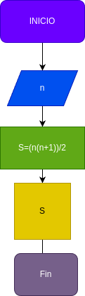

# Programa#1
programa para sumar los primeros numeros naurales 

# Analisis

## Imput

### Variables de entrada

n= valor a ingresar
## Processing

S=suma de los_n_primeros numeros 

### output
S=(n*(n+1))/2
# Diseño

# Construccion

